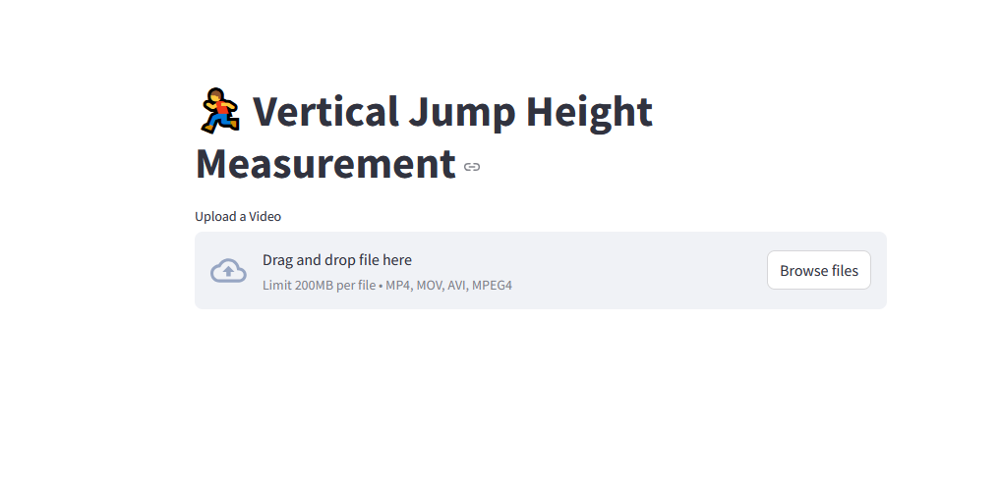
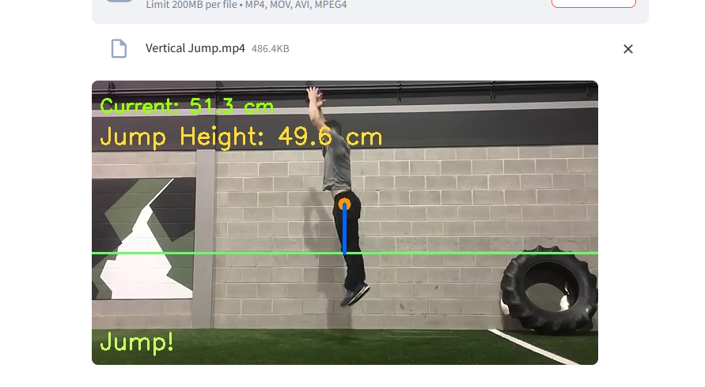

# Height Estimation from Video

This project estimates a person's height from a video using computer vision techniques. Users can upload a video, and the application will process it to estimate the height of the subject.

## Installation and Setup

### 1. Clone the Repository

```sh
git clone https://github.com/Anandukc/jumbhieghtestimation.git
cd jumbhieghtestimation
```

### 2. Create and Activate a Virtual Environment

#### On **Windows**:

```sh
python -m venv myvenv
myvenv\Scripts\activate
```

#### On **Linux/MacOS**:

```sh
python3 -m venv myvenv
source myvenv/bin/activate
```

### 3. Install Requirements

```sh
pip install -r requirements.txt
```

### 4. Run the Application

```sh
streamlit run main.py
```

## Output Screenshots

Below are example outputs of the application:


